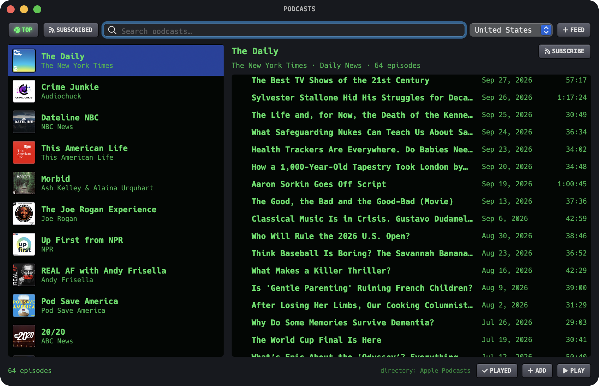

# OmniAmp

OmniAmp is a tiny, simple music player for macOS, inspired by Winamp.

It's written in Swift with AppKit and AVAudioEngine and has no third-party dependencies.

<p align="center">
  
  &nbsp;&nbsp;
  
</p>
<p align="center"><sub>The modern look (left) and the classic look with the original Winamp 2.91 skin (right).</sub></p>

## The modern look

A resizable native window with an LCD-style display, album art and the Hack Nerd Font. Pick one of five color themes inspired by old monochrome monitors:
- Green (default)
- Amber
- Blue
- Cyan/Teal
- Monochrome

The **INFO** drawer shows full tags, the file format, the album and cover art. The **EQ** drawer has the 10-band equalizer with presets.

<p align="center"></p>

## The classic look

Real Winamp 2.x skins: pixel-exact main, equalizer and playlist windows at 1×–4× size.
- **Built-in skin:** OmniAmp ships with the original Winamp 2.91 base skin.
- **Your own skins:** drag any `.wsz` onto the window, or use View → Skins → Load Skin….
- **Where to find more:** thousands of skins are at the [Winamp Skin Museum](https://skins.webamp.org).

## Internet radio

Press **RADIO** (or ⌘⌥R) to browse and search thousands of stations from [radio-browser.info](https://www.radio-browser.info). Filter by genre and country, star your favorites, and add stations to the playlist like any other track. Stations are saved in `.m3u`/`.pls` files along with their logos.
- **MP3/AAC/AAC+ (Icecast and SHOUTcast):** play through OmniAmp's own engine, so the EQ and visualizer work. The INFO drawer shows the song currently on air.
- **HLS and Ogg/Opus:** play through the macOS player.
- **Your own stations:** **+ URL** adds any stream or `.pls`/`.m3u` link from a station's website to Favorites.

<p align="center"></p>

## Podcasts

Press **PODCASTS** (or ⌘⌥P) to browse the top shows in your country or search the [Apple Podcasts](https://podcasts.apple.com) directory. Pick a show to see its episodes, subscribe to it, and play or add episodes to the playlist like any other track.
- **Subscriptions:** new episodes are counted under SUBSCRIBED each time you open the window.
- **Resume:** episodes continue where you stopped, and finished ones are marked as played.
- **Speed:** 1× to 2× (Controls → Podcast Speed), remembered per show, without changing the pitch.

<p align="center"></p>
- **Playback:** episodes stream through the macOS player, so the EQ and visualizer don't apply to them.
- **Any feed:** **+ FEED** subscribes to shows that aren't in the directory, including private or paid feeds with a personal link.

## Add URL

**ADD → Add URL…** (or ⌘L) takes any link and works out what it is:
- a live stream or a `.pls`/`.m3u` station playlist is added as radio;
- a podcast feed or an Apple Podcasts link opens the show in Podcasts;
- an audio file on the web is added as a track you can seek and resume.

## All features

**Playback**
- **Formats:** MP3, FLAC, ALAC/AAC (M4A), WAV (including RF64), AIFF and CAF, with built-in tag readers. The display shows exactly what's playing, e.g. "FLAC 24-bit / 96 kHz".
- **Gapless playback** between tracks that share a sample format.
- **Bit-perfect mode** (Output menu):
  - Matches the output device to each file's sample rate.
  - Bypasses the EQ and software volume, and uses the device's hardware volume when it has one.
  - Optional exclusive (hog) access.
  - Restores the device's original rate on quit.
- **Output device picker:** play to any output, or follow the system default.
- **ReplayGain:** track or album mode, with clipping protection.
- **CUE sheets:** a single-file album rip plus its `.cue` shows up as separate tracks that play gaplessly. Old Windows-1252 cue files work too.
- **Timers and toggles:**
  - stop after current (⇧V)
  - a sleep timer that fades out
  - resume position for long files and audiobooks
  - always on top

**Playlist**
- **Large folders:** drop in a whole music library; the playlist is kept between launches.
- **Editing:** drag to reorder, a play queue (Q), sorting, and removal of duplicates and missing files.
- **Watched folders:** the playlist follows your music folders live. New files appear next to their folder-mates, deleted files disappear and edited files are re-tagged. Your folder structure is never touched.
- **ADD menu:** Add Files…, Add Folder… and Add URL…, in both looks.
- **Playlist files:** open and save `.m3u`/`.m3u8`/`.pls` files, plus a list of saved playlists.
- **Jump to file (J):** type to search. Enter plays the result and clears the search; ⇧Enter keeps the results.
- **Display options:** choose the playlist font (Hack, Hack Compact or the classic font) and toggle track numbers.

**Scrobbling**
- **[Last.fm](https://www.last.fm) and [ListenBrainz](https://listenbrainz.org)** (Settings, ⌘,): Now Playing updates, standard scrobble rules and an offline queue. Logins are stored in the macOS Keychain.

**Look and feel**
- **Visualizer:** click it to cycle spectrum (with peak hold) → oscilloscope → L/R level meters → off.
- **Time display:** click the time to switch between elapsed and remaining.
- **Now Playing and media keys:** OmniAmp shows up in macOS Now Playing (menu bar and Control Center) with cover art, and the media keys work. Podcasts get 15 s back / 30 s forward buttons there.

## Keyboard shortcuts

| Key | Action | | Key | Action |
|---|---|---|---|---|
| `Z` | Previous | | `J` / ⌘F | Jump to track |
| `X` | Play | | `Q` | Queue selected track |
| `C` | Pause | | ⇧V | Stop after current |
| `V` | Stop | | ← / → | Seek |
| `B` | Next | | Space | Play / pause |
| ⌘O | Add files or folder | | ⌘⌥R | Internet radio |
| ⌘L | Add URL | | ⌘⌥P | Podcasts |

## Get it

### Download

Download the latest `OmniAmp-x.y.dmg` from [Releases](https://github.com/Doudini/omniamp/releases), open it and drag OmniAmp into Applications. Requires macOS 14 or later.

OmniAmp isn't signed with a paid Apple Developer certificate, so macOS blocks it the first time:

1. Open OmniAmp. When macOS says it can't check it, click **Done**.
2. Open **System Settings → Privacy & Security**, scroll down to the message about OmniAmp and click **Open Anyway**.

After that it opens normally. The DMG includes these steps as a text file. In the Terminal, `xattr -dr com.apple.quarantine /Applications/OmniAmp.app` does the same.

Last.fm and ListenBrainz scrobbling work out of the box (Settings, ⌘,).

**Updates:** choose **OmniAmp → Check for Updates…**. OmniAmp never checks by itself. When a newer release is available, it downloads it, checks it against GitHub's checksum and its code signature, installs it and relaunches. (0.2 has no updater yet, so get 0.3 from the Releases page once.)

### Build from source

You need macOS 14 or later and Xcode (Swift 6).

```sh
git clone https://github.com/Doudini/omniamp.git
cd omniamp
./scripts/make-app.sh   # release build → OmniAmp.app
open OmniAmp.app
```

Drag `OmniAmp.app` into `/Applications` to keep it.

### Last.fm API key (optional)

Last.fm requires every app to have its own API key, so a build made from this repo needs one for Last.fm scrobbling. ListenBrainz works without a key. Either enter your own key in **Settings → Last.fm → Use my own Last.fm API key**, or build it into the app:

1. Create a free API account at <https://www.last.fm/api/account/create>.
2. Put the key and secret in a `secrets.env` file in the repo root. Git ignores this file, so it is never committed:
   ```sh
   LASTFM_API_KEY=your_key
   LASTFM_SECRET=your_secret
   ```
3. Run `./scripts/make-app.sh`. The key is built into your `OmniAmp.app`.

## Development

```sh
swift build            # debug build
swift test             # unit tests
./scripts/make-app.sh  # release app bundle
./scripts/make-dmg.sh 0.2   # dist/OmniAmp-0.2.dmg for sharing
```

The app icon's source is `Resources/AppIcon.icon`. Open it in Icon Composer or edit its SVG, then run `./scripts/make-icon.sh`. The ideas we're saving for later are in [BACKLOG.md](BACKLOG.md).

### Signing and releases (maintainers)

`make-app.sh` signs with a self-signed **OmniAmp Code Signing** certificate when it's in your login keychain, and falls back to ad-hoc signing otherwise. With the certificate, every build counts as the same app. macOS then stops asking for the password before OmniAmp can read its saved logins, and Check for Updates only installs updates signed with the same certificate. To create it:

1. Open **Keychain Access** and choose **Keychain Access → Certificate Assistant → Create a Certificate…**
2. Name **OmniAmp Code Signing**, Identity Type **Self-Signed Root**, Certificate Type **Code Signing**, and tick **Let me override defaults**. Continue.
3. Set **Validity Period** to **3650** days, keep the other defaults and continue to **Create** (keychain: **login**).
4. Check: `security find-identity -p codesigning` lists "OmniAmp Code Signing".
5. Back up the certificate with its private key (**File → Export Items…** as .p12). Releases have to keep using this certificate.

Then `./scripts/release.sh 0.3` builds the DMG and publishes the GitHub release that Check for Updates finds.

## Credits

- **Fonts:** [Hack](https://github.com/source-foundry/Hack) and [Fira Code](https://github.com/tonsky/FiraCode), bundled as [Nerd Fonts](https://www.nerdfonts.com). Their licenses are in `fonts/`.
- **Classic skin:** the base skin is Winamp 2.91's original skin by Nullsoft.
- **Radio directory:** provided by the community-run [radio-browser.info](https://www.radio-browser.info).
- **Podcast directory:** Apple's podcast search and charts.
- **Screenshots:** the albums shown are fictional; their audio and covers were generated for these images.

OmniAmp is an independent project and is not affiliated with Winamp or Nullsoft.
