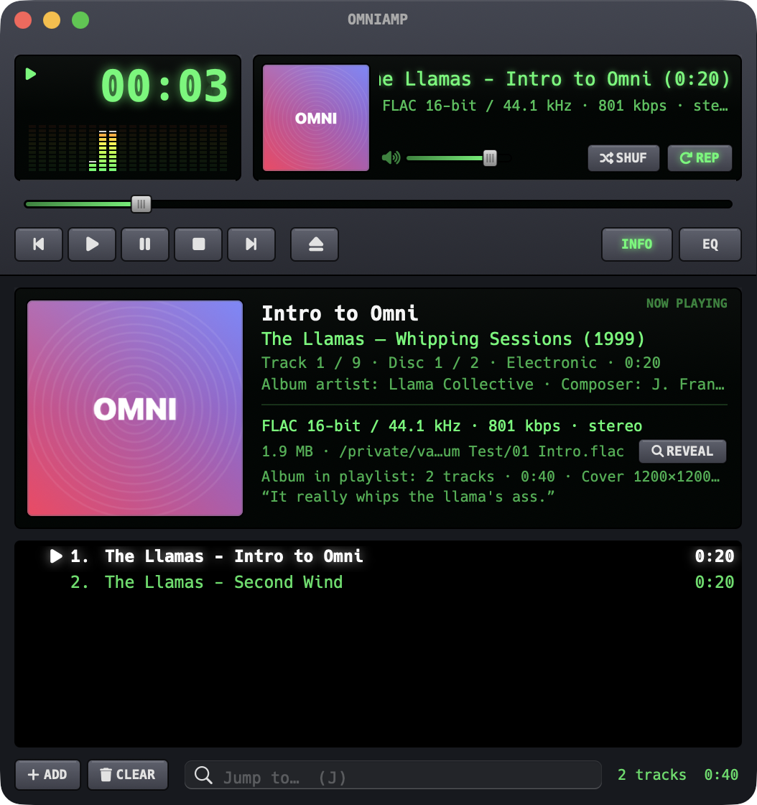

# OmniAmp

A small, fast, Winamp-inspired MP3/FLAC player for macOS, written in Swift with AppKit and AVAudioEngine. It has no third-party dependencies.

<p align="center"></p>

## Features

- **Instant playlists:** drop a folder and 10,000 tracks show up in about 0.2 s. Tags are read in parallel in the background, and the playlist is cached, so relaunching restores it in about 20 ms.
- **Two looks,** switchable from the View menu:
  - **Modern:** a resizable native window with an LCD-style display, album art, an INFO drawer and the Hack Nerd Font. Color themes are inspired by old monochrome monitors: Green (default), Amber, Blue, Cyan/Teal and Monochrome.
  - **Classic:** loads real Winamp 2.x `.wsz` skins with pixel-exact main, equalizer and playlist windows at 1×–4× size.
- **Formats:** MP3, FLAC, ALAC/AAC (M4A), WAV (including RF64), AIFF and CAF, all with fast built-in tag readers and bit depth shown (e.g. "FLAC 24-bit / 96 kHz").
- **Bit-perfect mode** (Output menu):
  - Switches the output device to each file's sample rate, so macOS doesn't resample.
  - Bypasses the EQ and software volume; volume goes to the device's hardware control if it has one.
  - Optional exclusive (hog) access.
  - The device's original rate is restored on quit.
- **Output device picker:** play to any output device, or follow the system default.
- **Scrobbling** to **Last.fm** and **ListenBrainz** (Settings, ⌘,): Now Playing updates, standard scrobble rules, and an offline queue. Logins are stored in the Keychain.
- **Gapless playback** between tracks that share a sample format.
- **ReplayGain** (track or album mode, with clipping protection), **stop after current** (⇧V), a **sleep timer** that fades out, **resume position** for long files and audiobooks, **always on top**, and a visualizer that cycles spectrum → oscilloscope → off.
- **10-band equalizer** with preamp and presets, available in both looks.
- **Watched folders:** the playlist follows your music folders live. New files are added next to their folder-mates, deleted files are removed and edited files are re-tagged, and tracks you removed by hand stay removed. Your folder structure is never touched.
- **Playlists:** open and save `.m3u`/`.m3u8`/`.pls` files, plus a list of saved playlists.
- **Winamp keys** (`Z X C V B`, `J` to jump to a file), media keys and Now Playing.

## Build

Requires macOS 14+ and Xcode / Swift 6.

```sh
swift build            # debug build
swift test             # unit tests
./scripts/make-app.sh  # release build → OmniAmp.app (icon: `swift scripts/make-icon.swift` after editing Resources/omniamp.svg)
open OmniAmp.app
```

### Last.fm API key (optional)

Last.fm requires every app to have its own API key, so a build made from this repo has scrobbling to Last.fm disabled until you add one. ListenBrainz works without it.

1. Create a free API account at <https://www.last.fm/api/account/create>.
2. Put the key and secret in a `secrets.env` file in the repo root. Git ignores this file, so it is never committed:
   ```sh
   LASTFM_API_KEY=your_key
   LASTFM_SECRET=your_secret
   ```
3. Run `./scripts/make-app.sh`. The key is built into your `OmniAmp.app`.

To use classic skins, drag any `.wsz` onto the window or use View → Skins → Load Skin…. Thousands of skins are available at the [Winamp Skin Museum](https://skins.webamp.org).

## Fonts

This repo bundles [Hack](https://github.com/source-foundry/Hack) and [Fira Code](https://github.com/tonsky/FiraCode) as [Nerd Fonts](https://www.nerdfonts.com). Their licenses are in `fonts/`.
